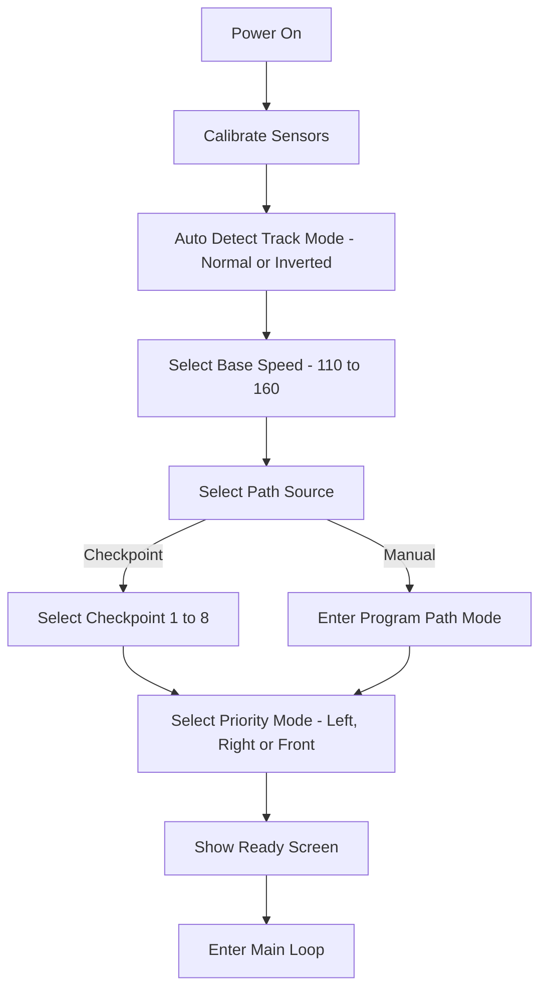
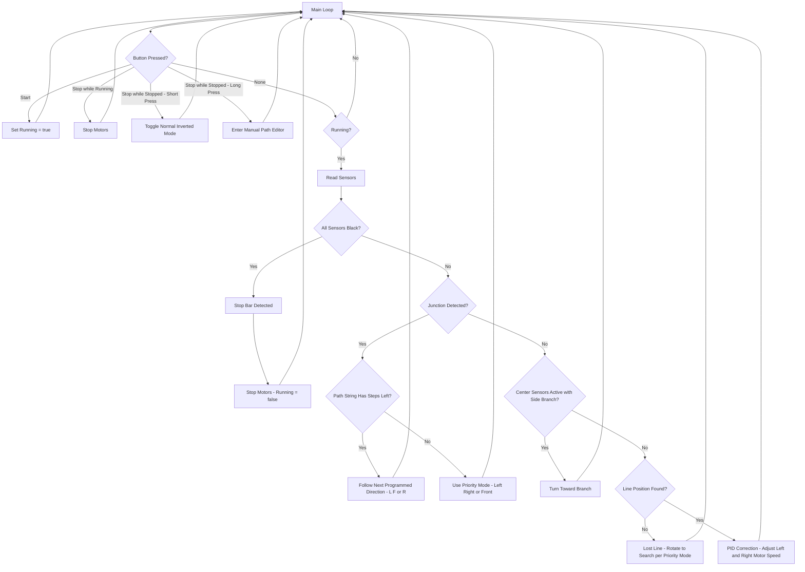

```mermaid
flowchart TD
    START[Power On] --> CAL[Calibrate Sensors]
    CAL --> DETECT[Auto Detect Track Mode - Normal or Inverted]
    DETECT --> SPEED[Select Base Speed - 110 to 160]
    SPEED --> SOURCE[Select Path Source]
    SOURCE -->|Checkpoint| CHECK[Select Checkpoint 1 to 8]
    SOURCE -->|Manual| MANUAL[Enter Program Path Mode]
    CHECK --> PRIORITY[Select Priority Mode - Left, Right or Front]
    MANUAL --> PRIORITY
    PRIORITY --> READY[Show Ready Screen]
    READY --> LOOP[Enter Main Loop]
```

```mermaid
flowchart TD
    LOOP[Main Loop] --> BTN{Button Pressed?}

    BTN -->|Start| RUN[Set Running = true]
    RUN --> LOOP

    BTN -->|Stop while Running| STOPNOW[Stop Motors]
    STOPNOW --> LOOP

    BTN -->|Stop while Stopped - Short Press| TOGGLE[Toggle Normal Inverted Mode]
    TOGGLE --> LOOP

    BTN -->|Stop while Stopped - Long Press| EDIT[Enter Manual Path Editor]
    EDIT --> LOOP

    BTN -->|None| CHECKRUN{Running?}
    CHECKRUN -->|No| LOOP
    CHECKRUN -->|Yes| READ[Read Sensors]

    READ --> BLACK{All Sensors Black?}
    BLACK -->|Yes| STOPBAR[Stop Bar Detected]
    STOPBAR --> STOPRUN[Stop Motors - Running = false]
    STOPRUN --> LOOP

    BLACK -->|No| JUNC{Junction Detected?}

    JUNC -->|Yes| PATHLEFT{Path String Has Steps Left?}
    PATHLEFT -->|Yes| FOLLOWPATH[Follow Next Programmed Direction - L F or R]
    FOLLOWPATH --> LOOP

    PATHLEFT -->|No| FALLBACK[Use Priority Mode - Left Right or Front]
    FALLBACK --> LOOP

    JUNC -->|No| CENTER{Center Sensors Active with Side Branch?}
    CENTER -->|Yes| BRANCHTURN[Turn Toward Branch]
    BRANCHTURN --> LOOP

    CENTER -->|No| POS{Line Position Found?}
    POS -->|No| SEARCH[Lost Line - Rotate to Search per Priority Mode]
    SEARCH --> LOOP

    POS -->|Yes| PID[PID Correction - Adjust Left and Right Motor Speed]
    PID --> LOOP
```
