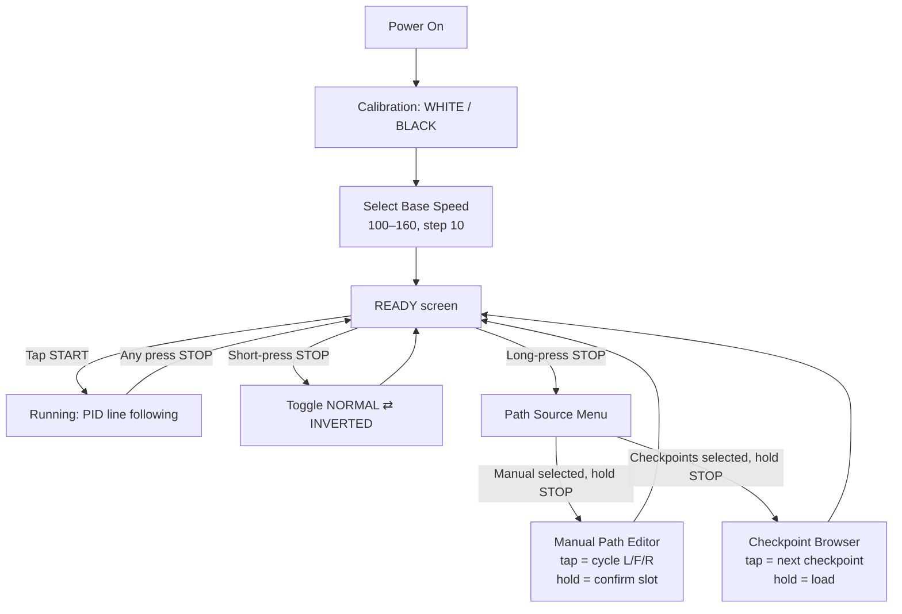

# 🏁 Team_Tafaling_LFR

### Autonomous PID Line Following Robot with Auto Mode-Detection, Checkpoint Path Memory & OLED Menu System

<p align="center">
  
  <br/>
  <!-- <em>📸 Robot photo — placeholder, replace with docs/images/robot-hero.png</em> -->
</p>

<p align="center">
  
  
  
  
</p>

---

## 📖 Overview

**Team_Tafaling_LFR** is a PID-controlled autonomous line-following robot built around an **Arduino Mega Pro Mini (ATmega2560)**. It uses an 8-channel IR sensor array to track a line, a **TB6612FNG** dual motor driver for propulsion, and an **SSD1306 OLED** display for a fully menu-driven, button-only control interface — no laptop or serial monitor needed after calibration.

The firmware's standout feature is **live automatic track-mode detection**: the robot continuously determines whether it's following a *black line on white* or a *white line on black* surface, and flips instantly (with a small noise guard) if the track changes color mid-run — no manual reconfiguration required. It also supports **preloaded checkpoint paths** and a **manual path editor** for forcing specific turns at known junctions.

---

## ✨ Features

- 🎯 **PID line following** with configurable `Kp` / `Kd` gains
- 🔄 **Live automatic NORMAL ⇄ INVERTED track detection** — flips instantly when the line color scheme changes mid-run, with a 2-sample noise guard against false triggers
- 🧭 **Shape-based junction detection** — recognizes cross junctions, left-T, and right-T junctions, not just a raw sensor-count threshold
- 🗺️ **Programmable path system** with two sources:
  - **Checkpoints** — up to 8 preloaded turn sequences baked into the firmware
  - **Manual editor** — live, button-driven path entry (`L` / `F` / `R`) via the OLED
- 🛑 **Stop-bar detection** — automatically halts at an all-black finish line
- 🔍 **Lost-line recovery** — remembers last known direction and searches intelligently
- 🖥️ **Full OLED menu system** — base speed selection, mode toggle, path source, checkpoint browser, and manual path editor, all controlled with just 2 buttons
- ⚡ **Selectable base speed** — 100 to 160 in steps of 10, chosen at boot
- 🔋 Runs off a **3S LiPo** stepped down through a **buck converter**

---

## 🎬 Demo

<p align="center">
  
  <br/>
  <em>🎥 Demo GIF — placeholder, replace with docs/images/demo.gif</em>
</p>

---

## 🧰 Hardware / Bill of Materials

| # | Component | Purpose |
|---|-----------|---------|
| 1 | **Arduino Mega Pro Mini (ATmega2560)** | Main microcontroller |
| 2 | **TB6612FNG** dual motor driver | Drives left & right DC motors |
| 3 | **8-Channel IR Sensor Array** | Line detection |
| 4 | **SSD1306 OLED Display (I2C, 128×64)** | Menu system & live status |
| 5 | **Buck Converter (step-down module)** | Regulates battery voltage for logic/sensors |
| 6 | **3S LiPo Battery** | Main power source |
| 7 | 2× DC Gear Motors + Wheels | Drivetrain |
| 8 | Chassis, push buttons (×2), wiring | Frame & controls |

<p align="center">
  
  <br/>
  <em>🔌 Circuit diagram — placeholder, replace with docs/images/circuit-diagram.png</em>
</p>

---

## 🔌 Pin Configuration

### Motor Driver (TB6612FNG)

| Signal | TB6612FNG Pin | Arduino Pin |
|--------|---------------|-------------|
| Motor A direction 1 | AIN1 | `D2` (`IN1`) |
| Motor A direction 2 | AIN2 | `D4` (`IN2`) |
| Motor A PWM | PWMA | `D3` (`ENA`) |
| Motor B direction 1 | BIN1 | `D6` (`IN3`) |
| Motor B direction 2 | BIN2 | `D7` (`IN4`) |
| Motor B PWM | PWMB | `D11` (`ENB`) |
| Standby | STBY | `D13` |

### Buttons

| Button | Arduino Pin | Function |
|--------|-------------|----------|
| **START** | `D10` | Start run / cycle menu options |
| **STOP** | `D12` | Stop run / short-tap = toggle mode / long-hold = path menu / confirm menu selection |

### OLED (SSD1306, I2C)

| Signal | Arduino Pin (Mega/ATmega2560) |
|--------|-------------------------------|
| SDA | `20` |
| SCL | `21` |

### IR Sensor Array

| Sensor | S0 | S1 | S2 | S3 | S4 | S5 | S6 | S7 |
|--------|----|----|----|----|----|----|----|----|
| Pin | `A7` | `A6` | `A5` | `A4` | `A3` | `A2` | `A1` | `A0` |

---

## 🧠 How It Works

1. **Calibration** — on boot, the robot samples WHITE then BLACK surfaces to compute a per-sensor threshold, and auto-detects the initial track mode (normal or inverted).
2. **Base speed selection** — the OLED menu lets you pick a base speed (100–160) before the robot goes to `READY`.
3. **Live tracking loop** — every cycle, sensors are read, the position error is computed, and a PID controller (`Kp`, `Kd`) adjusts left/right motor speeds to stay centered on the line.
4. **Auto mode-detection** — runs continuously in the background. If the current NORMAL/INVERTED interpretation stops making sense of the sensor readings but the opposite interpretation does, the robot flips modes almost instantly (2-sample noise guard) — no stall, no manual toggle needed.
5. **Junctions** — shape-based detection distinguishes cross junctions, left-T, and right-T junctions. If a checkpoint/manual path is loaded, the next letter (`L`/`F`/`R`) is consumed and executed; once the path is exhausted, the robot falls back to normal line-following.
6. **Stop bar** — an all-black reading under every sensor halts the robot and returns it to `READY`.

---

## 🖥️ OLED Menu System

All configuration is done with just **START (D10)** and **STOP (D12)** — no computer required after flashing.



### Controls summary

| Robot State | Action | Result |
|---|---|---|
| Stopped | Tap **START** | Begin running (executes loaded path, if any) |
| Running | Any press of **STOP** | Immediate stop |
| Stopped | **Short**-press **STOP** | Toggle NORMAL ↔ INVERTED track mode manually |
| Stopped | **Long**-press **STOP** (≥500ms) | Open **Path Source** menu (Checkpoints / Manual) |
| In Speed / Path menus | Tap **START** | Cycle through options |
| In Speed / Path menus | **Long**-press **STOP** | Confirm current selection |

---

## 🗺️ Path System

The robot can follow a pre-programmed sequence of junction directions (e.g. `"LLFRL"`). Once the sequence is used up, it automatically falls back to normal line-following — no forced turns.

### Checkpoints

Up to **8 checkpoints** are baked directly into the firmware as placeholders you can edit:

```cpp
const char* checkpointPaths[NUM_CHECKPOINTS] = {
  "LLFFRLLF",   // checkpoint 1
  "LFLLFF",     // checkpoint 2
  "",           // checkpoint 3 (placeholder)
  "",           // checkpoint 4 (placeholder)
  "",           // checkpoint 5 (placeholder)
  "",           // checkpoint 6 (placeholder)
  "",           // checkpoint 7 (placeholder)
  ""            // checkpoint 8 (placeholder)
};
```

Select **Checkpoints** from the Path Source menu, tap **START** to browse, and long-press **STOP** to load one.

### Manual entry

Select **Manual** from the Path Source menu to build a path live on the OLED — tap **START** to cycle each slot through `L → F → R → blank`, and long-press **STOP** to confirm a slot and move to the next. Confirming a blank slot ends and saves the string.

---

## ⚙️ Setup & Installation

### Requirements

- [Arduino IDE](https://www.arduino.cc/en/software) (or Arduino CLI / PlatformIO)
- Board package for **ATmega2560** (Arduino Mega / Mega Pro Mini)
- Libraries (install via Library Manager):
  - `Adafruit GFX Library`
  - `Adafruit SSD1306`
  - `Wire` (bundled with Arduino core)

### Flashing

1. Clone this repository:
   ```bash
   git clone https://github.com/<your-username>/Team_Tafaling_LFR.git
   ```
2. Open the `.ino` file in Arduino IDE.
3. Select **Board:** `Arduino Mega or Mega 2560` and the correct **Port**.
4. Click **Upload**.

### First run

1. Power the robot on a **white** surface, then move it to the calibration line as prompted (`WHITE...` → `BLACK...` on the OLED).
2. Select a **base speed** on the OLED (tap START to cycle, hold STOP to confirm).
3. (Optional) Long-press **STOP** to load a checkpoint or enter a manual path.
4. Tap **START** to run.

---

## 🩺 Troubleshooting

| Symptom | Likely Cause | Fix |
|---|---|---|
| OLED stays blank / robot freezes at boot | I2C address mismatch or wiring fault | Confirm SSD1306 is at `0x3C`; check SDA/SCL wiring |
| Robot oscillates hard on the line | `Kp`/`Kd` too aggressive for your surface/speed | Lower `Kp` and/or `Kd`, or reduce `BASE_SPEED` |
| Robot randomly flips NORMAL ⇄ INVERTED on a normal track | Sensor thresholds miscalibrated / inconsistent lighting | Recalibrate on the actual track surface and lighting conditions |
| Robot doesn't stop at the finish line | Stop bar not read as fully black | Ensure stop bar is wide/dark enough to trigger `allBlack()` under all 8 sensors |
| Junction turns fire at the wrong spot | `JUNCTION_COUNT` threshold or shape detection mismatch | Re-check IR sensor spacing and re-tune `isLeftT()` / `isRightT()` / `JUNCTION_COUNT` |
| Checkpoint appears "(empty)" | Placeholder not filled in | Edit `checkpointPaths[]` in the firmware and reflash |
| Motors spin the wrong direction | Motor wiring reversed | Swap the motor's two leads, or flip `fwd` logic in `motorLeft()`/`motorRight()` |

---

## 📁 Project Structure

```
Team_Tafaling_LFR/
├── Team_Tafaling_LFR.ino     # Main firmware
├── docs/
│   └── images/                # Robot photos, circuit diagrams, demo GIFs
├── LICENSE
└── README.md
```

---

## 🛣️ Roadmap

- [ ] Encoder-based speed feedback
- [ ] Bluetooth/WiFi telemetry & remote path upload
- [ ] Buzzer feedback for menu actions
- [ ] PID auto-tuning routine

---

## 👥 Team & Credits

| Name | Role |
|------|------|
| **Raiyyan Mahmud Alif** | Team Lead |
| *(add teammate)* | *(add role)* |
| *(add teammate)* | *(add role)* |

---

## 📄 License

This project is licensed under the **MIT License** — see the [LICENSE](LICENSE) file for details.

---

<p align="center">
  Made with ⚙️ and a lot of PID tuning by <strong>Team Tafaling</strong>
</p>
